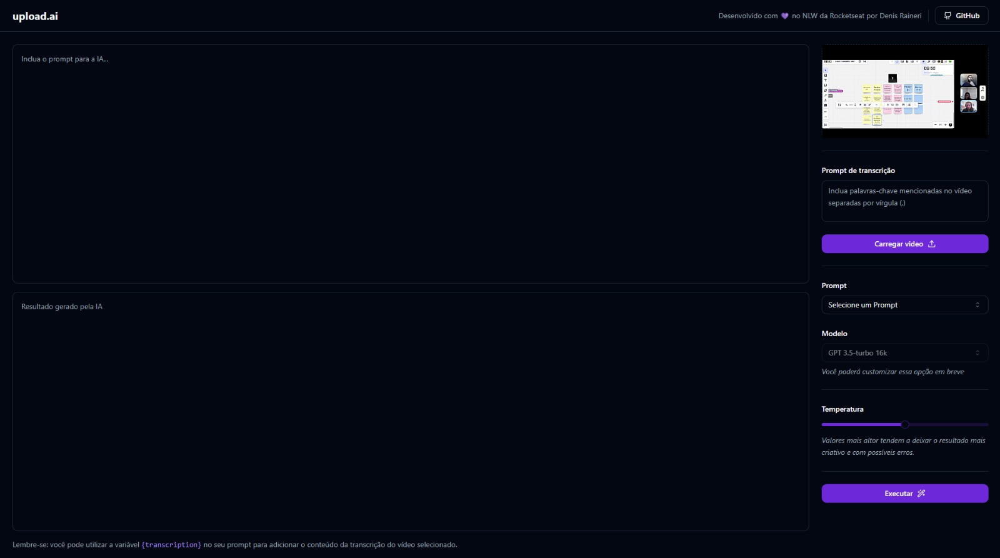

<!-- PROJECT LOGO -->

<p align="center">
   <!--   -->
</p>
   <h1 align="center"> upload.ai </h1>
 </p>
  	<br />
<p align="center"> 
   
	 
  	<a href="https://github.com/lamendes/nlw-ia/commits/master"> 
   		 
 	</a> 
 	/Rocketseat-%2304D361%22" alt="Languages">
  	<a href="https://opensource.org/licenses/MIT"> 
   		 
  	</a> 
</p>

<!-- TABLE OF CONTENTS -->

## 🗂 Conteúdo

<!-- - 📝 [Tabela de Conteúdo](#-tabela-de-conteúdo) -->

- 📋 [Projeto](#-projeto)
  - 🚀 [Tecnologias](#-tecnologias)
  - 📷 [Preview](#-preview)
- 📦 [Instalação](#-instalação)
- ⚖️ [Licença](#%EF%B8%8F-licença)
- 📫 [Contato](#-contato)

<!-- ABOUT THE PROJECT -->

## 💻 Projeto

Este projeto revolucionário foi concebido durante o evento nlw-IA, orientado por [Diego Fernandes](https://github.com/diego3g) da [Rocketseat](https://github.com/Rocketseat). Seu propósito central é desenvolver uma aplicação web de vanguarda que faça uso de inteligência artificial de última geração para automatizar a análise e extração de informações cruciais de vídeos. O nlw-IA representa mais um passo importante na missão da [Rocketseat](https://github.com/Rocketseat) de democratizar o acesso à tecnologia de IA, capacitando todos os desenvolvedores a criar soluções inovadoras e revolucionárias. O evento foi um verdadeiro sucesso, destacando ainda mais a excelência técnica e pedagógica da [Rocketseat](https://github.com/Rocketseat).

### 🚀 Tecnologias

- [React][react]
- [TypeScript][typescript]
- [Vite][ViteJS]
- [Tailwind][tailwind]
- [Shadcn/ui][shadcn/ui]
- [Lucide][Lucide]
- [OpenAi][openai]
- [Fastify][fastify]
- [Prisma][prisma]

## 📷 Preview

##### 💻 Frontend:

<p align="center"> 
  
</p>

## 📦 Instalação

Para clonar e executar está aplicação, você precisará do [Git](https://git-scm.com), [NodeJS v18.17.1][nodejs] ou superior + [npm v9.17.1][npm] ou superior e o [PNPm 8.7.5][pnpm] instalado no seu computador. No seu terminal rode:

```bash
# Clonando o repositório
$ git clone https://github.com/lamendes/nlw-ia.git nlw-ia
```

```bash
# Instalando o pnpm
$ npm install -g pnpm
```

<!-- ```bash
# Backend

# Ir até o repositório
$ cd /update-ai-backend

# Instalando as dependências
$ pnpm i
``` -->

```bash
# Frontend

# Ir até o repositório
$ cd /upload-ai-web

# Instalando as dependências
$ pnpm i

# Rodar Web
$ pnpm run dev
```

<!-- LICENSE -->

## 🪪 Licença

Esse projeto está sob a licença [MIT](LICENSE).

<!-- CONTACT -->

## 📫 Contato

by [**Denis Raineri**](https://www.linkedin.com/in/denis-pimentel-raineri-63a61b162/) 🚀

> **Nota**: Você pode utilizar outros gerenciadores de pacotes como `npm` ou `yarn` no lugar do `pnpm`, se preferir.

[nodejs]: https://nodejs.org/
[yarn]: https://yarnpkg.com/
[PNPm]: https://pnpm.io/pt/
[npm]: https://www.npmjs.com/
[ViteJS]: https://vitejs.dev/
[shadcn/ui]: https://ui.shadcn.com/
[Lucide]: https://lucide.dev/
[vc]: https://code.visualstudio.com/
[vceditconfig]: https://marketplace.visualstudio.com/items?itemName=EditorConfig.EditorConfig
[vceslint]: https://marketplace.visualstudio.com/items?itemName=dbaeumer.vscode-eslint
[html]: https://www.w3schools.com/html/
[express]: https://expressjs.com/
[nodemon]: https://www.postgresql.org
[expo]: https://expo.io
[react]: https://pt-br.reactjs.org
[tailwind]: https://tailwindcss.com
[sqlite]: https://www.sqlite.org
[knexjs]: http://knexjs.org
[cors]: https://www.npmjs.com/package/cors
[prettier]: https://prettier.io
[openai]: https://openai.com
[prisma]: https://www.prisma.io
[fastify]: https://fastify.dev
[eslint]: https://eslint.org
[celebrate]: https://github.com/arb/celebrate
[typescript]: https://www.typescriptlang.org/
